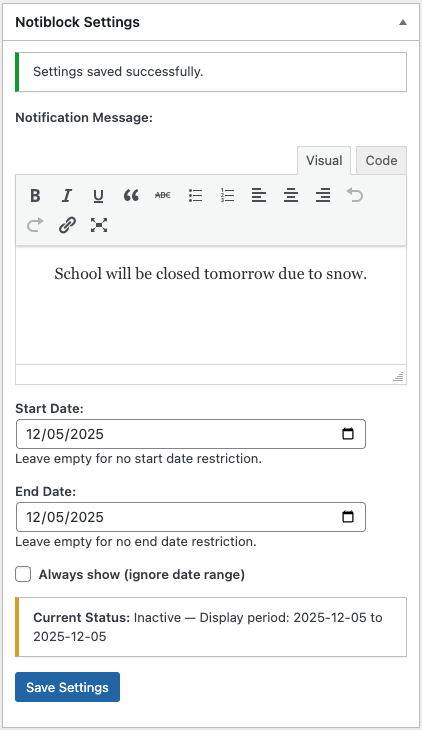

# Notiblock

Conditional notification blocks for WordPress with dashboard widget configuration.

## Installation

1. Download the latest release
2. Upload `notiblock.zip` via **Plugins → Add New → Upload Plugin**
3. Activate the plugin

## Usage

1. **Configure the notification:**
   - Go to **Dashboard → Notiblock Settings** widget
   - Enter your message, set start/end dates, and save

   

2. **Add the block:**
   - Edit any post, page, or template
   - Add the **Notiblock Conditional** block
   - The notification displays when the current date is within your date range

### Blocks

- **Notiblock Conditional** - Wrapper block that conditionally displays content based on date settings
- **Notiblock Message** - Displays the global notification message (only available inside Conditional block)

## Development

### Setup

```bash
npm install
```

### Build

```bash
# Development (watch mode)
npm start

# Production build
npm run build

# Create plugin zip
npm run plugin-zip
```

### Project Structure

```
notiblock/
├── build/              # Compiled files (generated)
├── src/
│   ├── conditional/    # Conditional wrapper block
│   └── message/        # Message display block
└── notiblock.php      # Main plugin file
```

## License

GPL v2 or later
